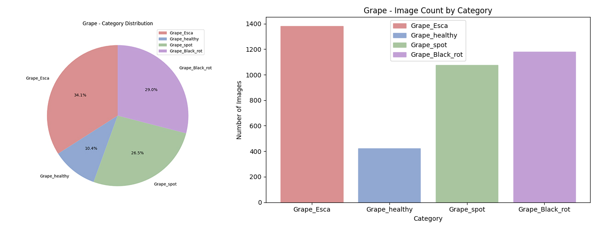
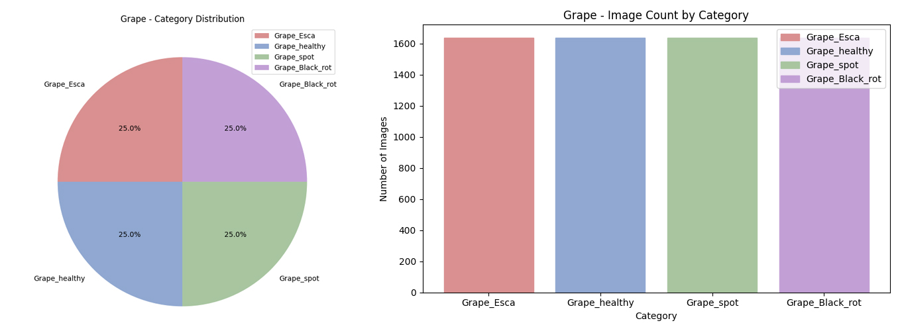
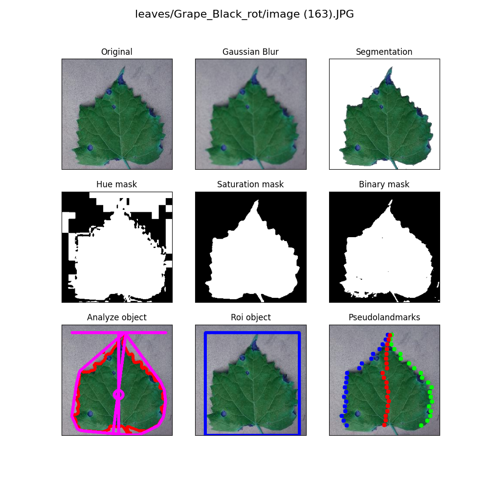
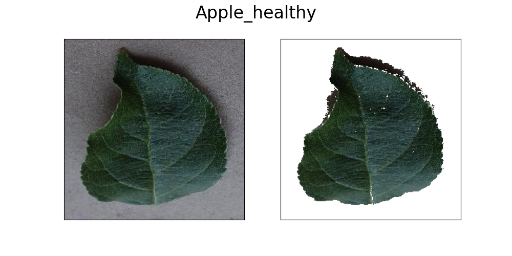
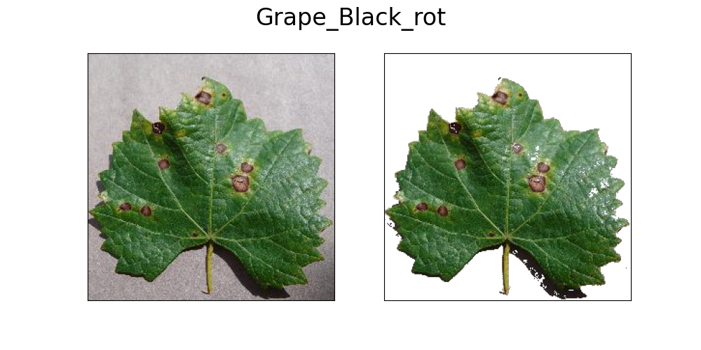
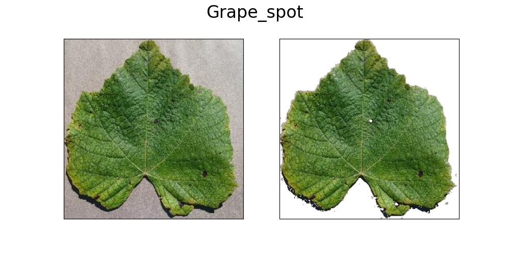

# Leaffliction

**Leaffliction** is a computer vision project designed to detect plant leaf diseases for applications in **precision agriculture**.
The project is structured as a tightly integrated pipeline—each module naturally builds upon the previous one, forming a coherent workflow.
It leverages libraries such as OpenCV, PlantCV, and PyTorch to create a practical, fully functional solution.

The system consists of five core components:

- Dataset distribution analysis
- Data augmentation and class balancing
- Image transformations and feature exploration
- Model training (CNN and ResNet-based CNN)
- Image prediction (single or batch)

## Setup

```bash
bash venv.sh
# Setup virtual environment and install dependencies

source venv/bin/activate
# Activate virtual environment
```

## Dataset

The dataset contains two plant species—grape and apple—each with four health conditions, forming a total of 8 classes.

Each subfolder inside the dataset directory represents one class, and the folder name corresponds directly to the species and its condition. This makes the data automatically interpretable.

## 1.Distribution Anaylsis

This module analyzes the dataset by scanning subdirectories, counts images per class, and generates:
- Pie charts
- Bar charts

Labels are derived automatically from folder names.

```python
python Distribution.py leaves
```

We observe that initial distribution results reveal significant class imbalance..



## 2.Data Autmentation

To address imbalance, this module applies controlled augmentation until all classes reach similar sample sizes.

Six augmentation operations are provided:

 - Flip
 - Rotate
 - Skew
 - Shear
 - Crop
 - Distortion

```python
python Augmentation.py leaves
```
After augmentation, the dataset becomes balanced and ready for model training.




## 3.Transformation

This module explores and visualizes key image features using classical computer vision techniques. It supports both single-image mode and directory-level processing, saving all outputs automatically.

Included transformations:

- Gaussian blur
- Mask generation
- ROI detection
- Object analysis
- Pseudolandmarks
- Color histogram
- Segmentation


```python
python Transformation.py path 
```


This stage bridges raw imagery and deep learning by revealing underlying structure and patterns.

## 4.Training

The training module builds a leaf disease classifier using **deep learning** to automatically detects the type and the health state of each leaf.
GPU is detected automatically when available.
The project supports multiple model architectures for comparing their performance, between:

- **CNN**
- **ResNet-based CNN**

```bash
python train.py leaves -m CNN
# or
python train.py leaves -m RESNET
```

Training metrics:


This module:

- loads and preprocesses images
- splits them into training and validation sets
- trains the selected model
- saves trained weights

## 5.Predict

```bash
python predict.py path -l weights.pth
```

### Prediction on 1 image

When the provided path points to a single image, the prediction module automatically loads and displays the image, generates its segmentation result and overlays the predicted label directly on the visualization.





### Batch prediction example

When path points to a directory, the folder must follow the same structure as the training dataset: each class (ground truth) should be stored inside a subfolder named after its label. This allows the script to automatically read true labels and evaluate performance.

During batch prediction, the module will: iterate through all images in their respective class folders, generate predictions, compare them with ground truth labels and calculate accuracy. Finally it saves results into a CSV file in the format:

```csv
path,prediction
leaves_test/Apple_Black_rot/image (106).JPG,Apple_Black_rot
leaves_test/Apple_Black_rot/image (149).JPG,Apple_Black_rot
...
```

The model achieves 96–99% accuracy across all 8 classes, demonstrating both reliability and practical usability.

## Performance tracking 

To evaluate the impact of different model architectures and data augmentation strategies, we first use the script split.py to divide the dataset. From approximately 7,000 samples, 800 images are extracted as the test set, while the remaining data is used for training and validation. These test samples are completely unseen during training. Accuracy and the number of correct predictions are calculated exclusively on this independent test set.

```bash
python split.py leaves
```

Next, we optionally apply data augmentation using Augmentation.py.
For each configuration, the model is trained and evaluated three times to obtain average accuracy.

Training and predicting with the CNN model

```bash
python train.py leaves
python predict.py leaves_test/ -l weights.pth
```

Training and predicting with the CNN-ResNet model

```bash
python train.py leaves -m RESNET
python predict.py leaves_test/ -l weights.pth -m RESNET
```


|Setup |Acc1| Correct Pred1|Acc2| Correct Pred2|Acc3| Correct Pred3| avg Acc |
|-------|------|------|------|------|------|------|------|
|Raw + CNN| 96.75% |774/800 | 97.25%| 778/800| 96.62% | 773/800| 96.87%|
|Raw + CNN-Resnet| 99.50% |796/800 | 99.25%| 794/800| 99.38%| 795/800| 99.38%|
|Augmented + CNN| 95.88% | 767/800 |  98.12% | 785/800| 97.12% | 777/800|97.04% |
|Augmented + CNN-Resnet|99.25%| 794/800 | 98.62% | 789/800 |98.38% |  787/800| 98.75%|


Due to the high quality of this dataset, a traditional CNN model is already able to achieve an accuracy between 96% and 97%. However, by increasing network depth and introducing residual connections, the ResNet-based model further improves overall accuracy to more than 98.5%, making the predictions more reliable. These results show that introducing ResNet significantly improves prediction accuracy compared with the baseline CNN model, both with and without data augmentation.

Although data augmentation usually helps improve generalization, it seems to slightly reduce accuracy when used with ResNet in this task. My guess is that the dataset is already clean and consistent, so ResNet can learn strong features directly from the original images. Some augmentation operations might be introducing distortions that affect important details, which may not match the distribution of the clean test set. Because of this, the extra noise could be hurting the performance a little instead of helping.

## Summary

Leaffliction is a complete, interconnected pipeline for plant leaf disease detection. From dataset analysis to augmentation, transformation, training, and prediction, every stage is designed to support and enhance the next, forming a seamless end-to-end system.

By automating leaf disease recognition, this project helps:

- reduce manual inspection
- detect issues earlier
- prevent large-scale crop losses
- support smart farming decisions
- enable drone or greenhouse monitoring platforms

With its unified workflow and strong performance, Leaffliction shows how computer vision can be effectively applied to build scalable, impactful tools for modern agriculture.